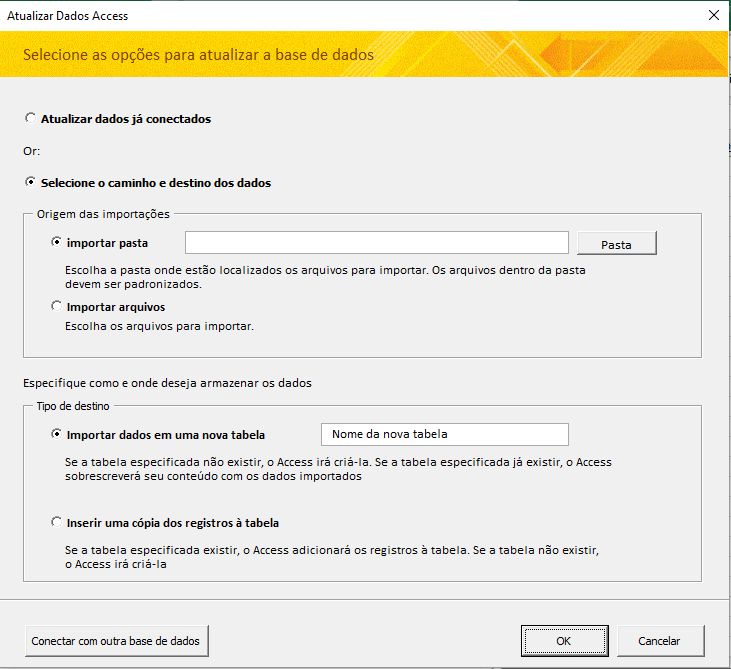
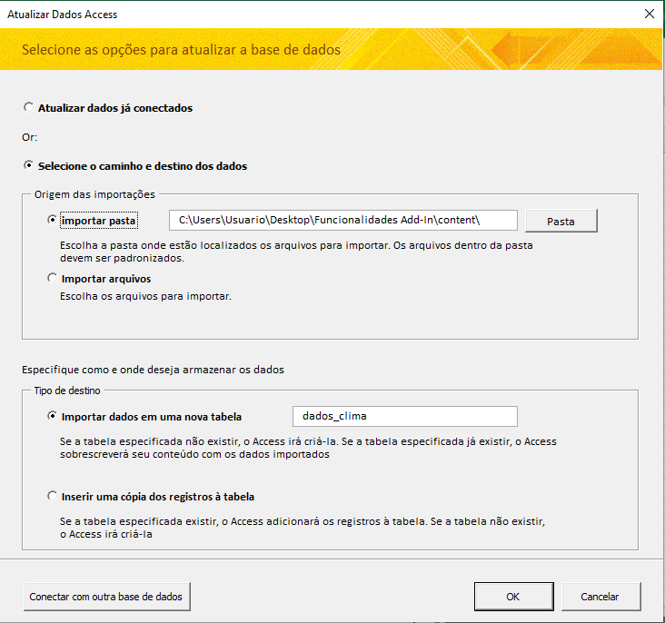
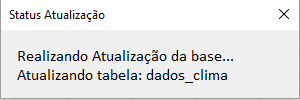

# Como usar e Funcionalidades do Add-In

## Índice

O Add-In “Import and Update Access” é uma ferramenta que permite integrar o excel e o access de forma simples e eficiente. Com ele, você pode importar pastas com vários arquivos para o access e atualizar as tabelas automaticamente, sem precisar abrir o programa.

O Add-In é ideal para quem trabalha com grandes volumes de dados, fazendo com que seja possível acessar os dados no excel de forma rápida e organizada, reduzindo o tamanho dos seus arquivos excel e adicionando agilidade e praticidade na hora de analisá-los.

---

## Estrutura dos arquivos

Para que seja possível usar o Add-In, é necessário os seguintes requisitos:

- Um arquivo ou pasta com as bases de dados.
- Um arquivo access
- Um arquivo excel

Como exemplo, podemos ter a seguinte estrutura:

```markdown
Pasta Funcionalidades Add-In
|
|----Pasta content
|----Access base_dados.accdb
|----Excel Analises.xlsxx
```

Onde:

- A pasta principal onde está os arquivos se chama “Funcionalidades Add-In”;
- A pasta “content” é onde está localizado os arquivos excel com as bases de dados;
- Também haverá um arquivo access vazio chamado “base_dados.accdb”;
- E também um arquivo excel chamado “Analises.xlsx”.

> Dica: A estrutura e o nome dos arquivos não necessitam ser esses para que a ferramenta funcione. Você pode escolher sua própria estrutura e nome de arquivos. O importante é que haja pelo os três elementos citados, o arquivo access, o arquivo excel e as bases de dados.
> 

---

## Iniciando uma conexão com o arquivo Access

Com a estrutura montada, precisaremos trabalhar inicialmente apenas no arquivo excel.

Ao abrir o arquivo excel, vá até o ícone onde você colocou o Add-In e clique. A funcionalidade tentará conectar com uma base de dados, porém, ele ainda não sabe a qual base de dados, por isso aparecerá a seguinte mensagem:


Para seguir com a conexão, clique em “Sim” e escolha o arquivo access que deseja conectar. Após isso, irá abrir a janela com as funcionalidades de importação.

Antes de verificarmos a janela aberta, uma forma de confirmar que a conexão foi estabelecida é verificar se na pasta onde está o arquivo access apareceu um arquivo temporario, com a extensão “.laccdb”. Enquanto a funcionalidade for usada, este arquivo vai estar aparecendo na pasta. Caso clique o botão de cancelar ou os processos sejam finalizados, a base de dados é desconectada e o arquivo some (por isso é um arquivo temporário).

Outro ponto importante é que, uma vez conectado, não será necessário fornecer novamente o caminho da base de dados para realizar a conexão. Para verificar isso, basta clicar em “Cancelar” para que fechar a janela. Clicando novamente no botão do Add-In, você perceberá que a tela de importação irá abrir direto, pois a conexão ficou gravada na memória da planilha.

Para mais detalhes sobre essa implementação, veja: 

[Detalhes Técnicos de Implementação](Detalhes_Tecnicos_de_Implementacao.md)

---

## Escolhendo o tipo de atualização da base Access

Vamos ver a tela de importação, onde estarão as principais funcionalidades:



Janela de importação

Nesta tela temos:

- **Atualizar dados já conectados:** Esta opção faz a atualização automática das bases de dados que já foram importadas e conectadas pela funcionalidade. As conexões são realizadas no momento da importação, conforme será explicado abaixo.
- **Selecione o caminho e destino dos dados:** Nesta opção, haverá os parâmetros para realizar a primeira importação e conexão dos dados.

Na primeira vez que abrirmos o Add-In com uma base de dados nova, será necessário preencher os parâmetros da segunda opção, para que seja possível utilizar a primeira opção.

> Neste Add-In, é possível realizar as importação apenas de arquivos com extensão excel (“.xlsx”).
> 

---

## Definindo a origem dos dados

Na quadro **“Origem das importações”,** é onde será definido a localização dos dados. Para isso temos duas opções:

- **Importar Pasta:** Nesta opção, é escolhido a localização da pasta e todos os arquivos que estiverem dentro desta pasta serão cobinados e importados em uma tabela. Para que funcione de maneira correta, todos os arquivos dentro da pasta precisam ter o mesmo padrão de colunas para que o programa consiga combinar as bases. Dessa forma, o caminho da pasta com os arquivos será vinculado na tabela do banco de dados para que possa ser realizado a atualização automática.
- **Importar Arquivos:** Nesta opção, é possível selecionar 1 ou mais arquivos para importar.
    - Ao selecionar um único arquivo, o programa lê os dados desse arquivo e importa para uma tabela do access. É possível observar que uma opção será habilitada com o nome de “Criar vinculo com arquivo”. Caso ela seja habilitada, o programa fará o vinculo com o arquivo específico que foi selecionado, fazendo com que, quando for realizada a atualização automática (que veremos a frente), o programa irá ler apenas este arquivo específico.
        
        > Importante: caso o nome do arquivo ou da pasta seja alterado, o vínculo se perderá e precisará ser refeito.
        > 
    - Ao selecionar 2 ou mais arquivos, o programa fará um procedimento semelhante ao descrito no “Importar Pasta”, com a diferença que os arquivos que serão combinado e importados na base serão os selecionados. Nesta opção, o programa vincula o caminho da pasta onde estão os arquivos.

---

## Definindo o destino dos dados no Access

Passando para o segundo quadro entitulado “Tipo de destino”, será escolhida para qual tabela os dados serão importados, podendo ser:

- **Importar dados em uma nova tabela**: Nesta opção o programa irá criar uma nova tabela com o nome que for informado e importará os dados nela.
    
    > Importante: Caso o nome da tabela já exista, o programa exclui a tabela antiga e cria uma nova, com os novos dados. Então cuidado ao definir os nomes das tabelas.
    > 
- **Inserir uma cópia dos registros à tabela**: Caso você ja tenha incluido alguma tabela no seu access e deseja acrescentar novos dados, esse opção fará este procedimento. Ao seleciona-la, aparecerá uma caixa com uma lista de todas as tabelas que já existem no banco de dados, possibilitando que você insira dados em uma tabela já existente.

---

## Botões de comando

Por fim, temos os seguintes botões de comando com as seguintes características:

- **Botão “Cancelar”:** Cancela a operação e desconecta com o banco de dados.
- **Botão “OK”:** Ao clicar neste botão, o programa inicia os procedimentos de importação conforme definido nos parâmetros descritos acima. Ao iniciar o procedimento, o programa irá abrir uma nova janela mostrando o status da atualização. Terminando o procedimento, haverá uma mensagem para confirmar no botão de “OK”, se houver algum erro, irá aparecer uma mensagem com o erro para avaliação.
- **Botão “Conectar com outra base de dados”**: Este botão repete o procedimento de conexão feito ao iniciar o programa pela primeira vez, onde fizemos uma primeira conexão. Ao clica-lo, você precisará escolher qual o novo arquivo access que deseja conectar e o programa irá realizar a conexão com o novo arquivo.

## Exemplo com dados reais

Vamos ver um fluxo de processo onde a ferramenta pode ser bem aproveitada. Para isso, vou me basear na estrutura apresentada no tópico [Estrutura dos arquivos](#estrutura-dos-arquivos) 

Dentro da pasta “content” haverá 6 arquivos excel com dados meteorológicos de algumas cidades. Esse dados podem ser obtidos através do site do [INMET](https://portal.inmet.gov.br/dadoshistoricos).

> Importante: Caso queira acompanhar o exemplo do seu computador, ao baixar os dados do INMET, você poderá perceber que os arquivos são originalmente no formato CSV. Como para o nosso exemplo, precisamos de arquivos excel (XLSX), peguei alguns arquivos de exemplo e salvei em XLSX, por isso, você precisará fazer o mesmo para seguir com o exemplo.
> 

Com os arquivos na pasta, podemos abrir o arquivo “Analises.xlsx” para iniciar. Em seguida, vamo clicar no ícone do Add-In que foi instalado. No meu caso, colquei na guia “Desenvolverdor”, no grupo “Add-Ins”.


Ao clicar, irá aparecer a janela conforme demonstrado no tópico [Iniciando uma conexão com o arquivo Access](#iniciando-uma-conexão-com-o-arquivo-access). Ao clicar em sim, navego até a pasta onde está localizado o arquivo Access, seleciono ele e clico em “OK”. 

O programa irá iniciar a conexão com o arquivo Access, e com a conexão sendo bem sucedida, irá abrir a janela de importação.


Janela de importação

Como é a primeira vez que estamos importando os dados, vamos precisar fornecer os parâmetros da opção “Selecione o caminho e destino dos dado”.

Neste exemplo, quero importar e combinar em uma única tabela todos os arquivos que estão na pasta content. Por isso, vou escolher a opção “Importar pasta” e clicar no botão “Pasta” para fornecer o caminho da mesma.

Em seguida, vou selecionar o destino destes arquivos. Então, no segundo quadro, escolho a opção “Importar dados em uma nova tabela” e coloco o nome da tabela como “dados_clima”. A tela de importação ficou da seguinte maneira.



Com os parâmetros preenchidos, basta clicar em “OK”. Irá aparecer a janela abaixo com o status da atualização. A tela se manterá ativa enquanto estiver ocorrendo o processo de importação.



Ao concluir o processo, uma confirmação do processo irá aparecer, basta clicar em “OK”.


Pronto, sua tabela já está importada no arquivo Access. 

Agora, para trazer os dados para o excel, tem algumas opções. 

- Para quem gosta de trabalhar com o Power Query, pode importar indo em Dados > Obter Dados > De Bancos de Dados > De Banco de Dados do Microsoft Access, e seguir os passos normais de importação dos dados.
- Para quem gosta de trabalhar com SQL, pode importar indo em Dados > Obter Dados > De Outras Fontes > Do Microsoft Query. Ao seguir os passos de importação, você chegará em uma tela que vai te dar duas opções, uma delas sendo “Ver dados ou Editar Consulta no Microsoft Query”. Ao selecionar esta, você será levado para a tela do Microsoft Query, onde hacerá um botão com o nome “SQL”, onde você poderá editar sua consulta.
- Uma terceira opção, também para quem prefere trabalhar com SQL, é criar as consultas no próprio Access, com toda a manipulação necessária e fazer a conexão da mesma forma que na primeira opção, porém com a consulta ao invés da tabela. Uma vez criada a consulta, sempre que os dados da tabela forem atualizados, a consulta já trás os dados atualizados também.

Para fazer uma comparação dos métodos e utilizar uma das grandes vantagens dessa ferramenta, vou colocar todos os arquivos da base do INMET na pasta content. Todos os arquivos somados contém mais de 4.900.000 de linhas.

Após colocar todos os arquivos na pasta, vou até o excel rodar o Add-In, porém, dessa vez, vou selecionar a primeira opção: “Atualizar dados já conectados” e clicar em “OK”. Desta forma, ele já reconhece os parâmetros que colocamos nos passos anteriores e faz a atualização automática incluindo todos os arquivos na pasta. Como aparece no aviso ao selecionar esta opção, o programa também já lê todas as tabelas no banco de dados e atualiza todas de uma só vez.

Como são muitos dados, normalmente o processo demorará um pouco mais para ser realizado.

Após concluído, vamos ver a comparação de performance de cada modo de importação. Para essa comparação, nos três caso, realizei a média total por dia de uma coluna de precipitação e uma coluna de temperatura, fazendo com que eu saia de uma base de mais de 4 milhões de linhas, para uma com 365 linhas (1 para cada dia do ano).

Também adicionei uma comparação, importanto os dados direto da pasta para o excel pelo power query, sem usar o Access como um intermediário.

[Database](../doc_/imgs_como_usar/Database.csv)

> Considerações importantes:
> 

> 1. Como foi dito no ínicio deste documento, esta ferramenta se destina a quem quer integrar o Access e o Excel de forma mais simples e rápida. Se não há a necessidade de usar o Access, use o Power Query diretamente, pois é uma funcionalidade que a microsoft implementou nas versões mais novas, mais robustas e que já automatiza grande parte da manipulação de dados.
> 

> 2. Uma das principais funções deste Add-In é adicionar a função de importar arquivos de pasta no excel. Até o momento que estou escrevendo esta documentação, no Access não há esta opção como existe no excel, Essa foi a principal motivação deste Add-In.
> 

> 3. É importante poderar a ferramenta que será usada em cada caso. Neste exemplo, provavelmente se fossemos trabalhar com milões de linhas de dados, o pacote office não seria o mais recomendado, pois seria bem mais simples trabalhar com ferramentas otimizadas para milhões de dados, como python. O exemplo acima foi apenas para forçar a ferramenta ao máximo para que pudessemos realizar uma comparação.
>
