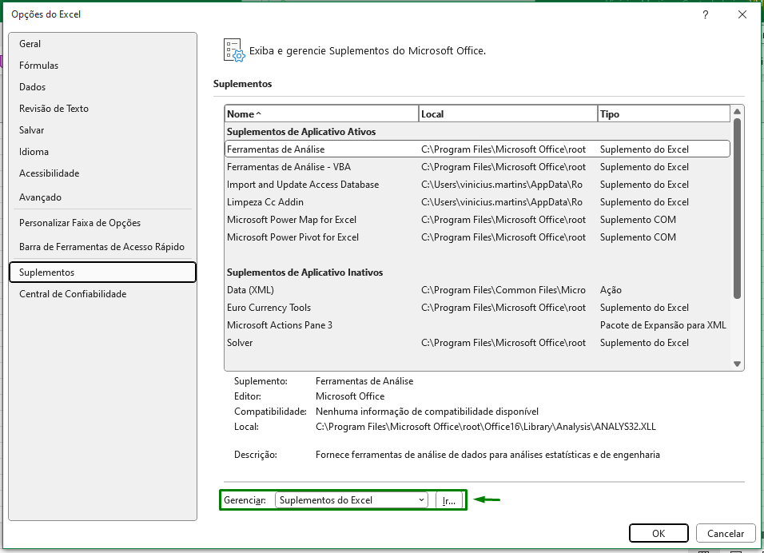
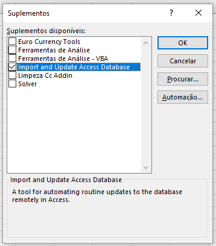
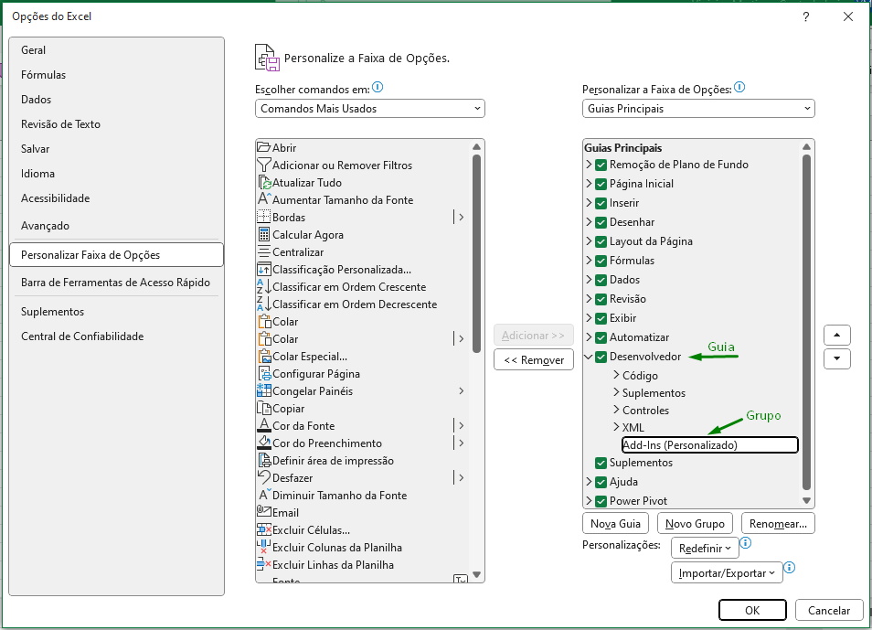
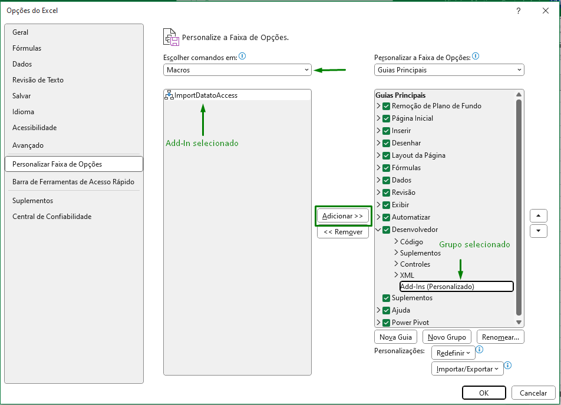
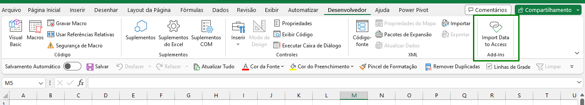

# Instalação do Add-In

## Instalação

1. **Etapa 1: Obtendo o arquivo:**
    
    Para realizar a instalação do AddIn, é necessário ter baixado o arquivo chamado [Importar_e_atualizar_Access_ptbr.xlam](https://github.com/ViniPMartins/AddIn-Import-and_Update_Access/blob/main/arquivos_addin/).
    
    Com o arquivo baixado, mova-o para a seguinte pasta:
    
    <aside>
    📁 C:\Users\[Seu usuário do Windows]\AppData\Roaming\Microsoft\AddIns
    
    </aside>
    
2. **Configurando o Excel:**
    
    Abra uma planilha em excel e vá até o seguinte caminho:
    
    <aside>
     Arquivo / Opções / Suplementos
    
    </aside>
    
    Irá aparecer uma tela semelhante a esta.
    
    
    
    Na opção Gerenciar (destacada na imagem), selecione a opção “Suplementos do Excel” e clique em “Ir..”
    
    Em seguida será mostrada uma segunda tela onde podemeros ver vários Suplementos (Add-In), inclusive o suplemento referente ao arquivo que colocamos na pasta.
    
    
    
    Selecione o suplemento assim como na imagem e clique em “OK”. O excel irá instalar o Add-in e disponibilizar os códigos em todas os arquivos excel a partir de agora.
    
    Por fim, é necessário disponibilizar a funcionalizadade no Add-In como um “botão” no excel. Para isso vá até o seguinte caminho:
    
    <aside>
     Arquivo / Opções / Personalizar Faixa de Opções
    
    </aside>
    
    Em seguida, vamos ter que criar um grupo personalizado. No exemplo, estou criando um grupo personalizado dentro da guia “Desenvolvedor”. Para isso, habilito a guia “Desenvolver”, seleciono ela e clico em “Novo Grupo”, então, clico em “Renomear” e coloco o nome do grupo como “Add-Ins”.
    
    > Dica: Caso prefira, crie um grupo personalizado na guia que preferir, ou então, pode até criar uma nova guia personalizada e dentro dessa guia, um novo grupo.
    > 
    
    
    
    Agora é necessário colocar a funcionalidade do suplemento dentro desse grupo. Para isso, ainda na tela anterior, selecione a opção “Macros” nas opções e irá aparecer o Add-In.
    
    > Importante: Caso tenha outros suplementos instalados, todas as funcionalidades irão aparecer nesta tela.
    > 
    
    Selecione a funcionalidade Add-In e selecione o grupo de destino. Com ambos selecionados, clique em adicionar para disponibilizar a função no grupo.
    
    Por fim clique em “OK”.
    
    
    
    Pronto, o suplemento está instalado e pronto para ser usado. Você pode verificar indo na guia em ele foi adicionado. No caso do exemplo, ele está na guia desenvolvedor.
    
    > Dica: No passo anterior onde adicionamos o suplementos no grupo, antes de clicar em OK para confirmar, é possível renomear e alterar o símbolo de exibição do suplemento. No caso do exemplo, separei as palavras e escolhi um símbolo que lembra um vínculo.
    > 
    
    
